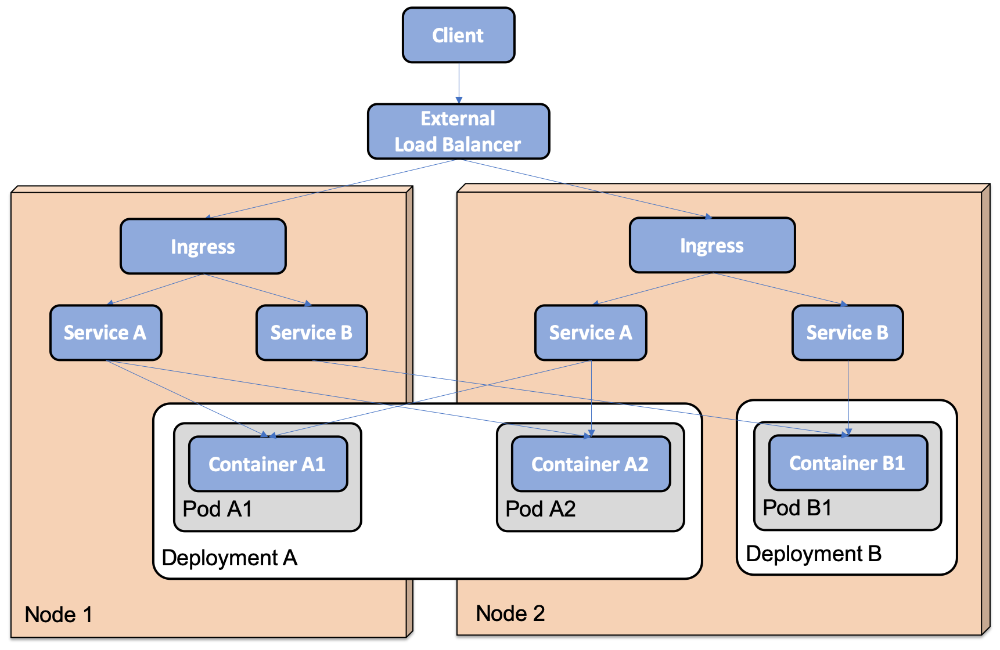
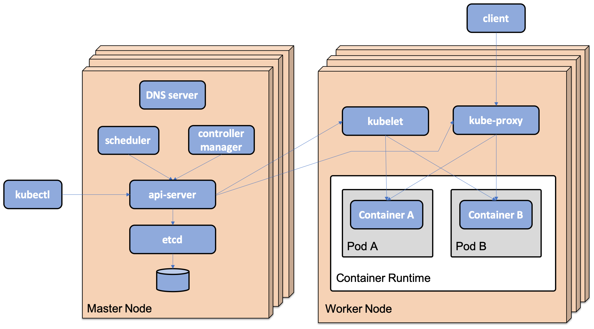

= Kubernetes

== Introducing Kubernetes API objects

- Node: A node represents a server, virtual or physical, in the cluster.
- Pod: A pod represents the smallest possible deployable component in Kubernetes, consisting of one or more co-located containers.
Typically, a pod consists of one container, but there are use cases for extending the functionality of the main container by running the second container in a pod.
- Deployment: Deployment is used to deploy and upgrade pods.
The deployment objects hand over the responsibility of creating and monitoring the pods to a ReplicaSet.
When creating a deployment for the first time, the work performed by the deployment object is no much more than creating the ReplicaSet object.
When performing a rolling upgrade of deployment, the role of the deployment object is more involved.
- ReplicaSet: A ReplicaSet is used to ensure that a specified number of pods are running at all times.
If a pod is deleted, it will be replaced with a new pod by the ReplicaSet.
- Service: A service is a stable network endpoint that you can use to connect to one or multiple pods.
A service is assigned an IP address and a DNS name in the internal network of the Kubernetes cluster.
The IP address of the service will stay the same for the lifetime of the service.
Requests that are sent to a service will be forwarded to one of the available pods using round-robin-based load balancing.
By default, a service is only exposed inside the cluster using a cluster IP address.
It is also possible to expose a service outside the cluster, either on a dedicated port on each node in the cluster or – even better – through an external load balancer that is aware of Kubernetes, that is, it can automatically provision a public IP address and/or DNS name for the service.
Cloud providers that offer Kubernetes as a service, in general, support this type of load balancer.
- Ingress: Ingress can manage external access to services in a Kubernetes cluster, typically using HTTP.
For example, it can route traffic to the underlying services based on URL paths or HTTP headers such as the hostname.
Instead of exposing a number of services externally, either using node ports or through load balancers, it is, in general, more convenient to set up an Ingress in front of the services.
To handle the actual communication defined by the Ingress objects, an Ingress controller must be running in the cluster.
We will see an example of an Ingress controller as we proceed.
- Namespace: A namespace is used to group and, on some levels, isolate resources in a Kubernetes cluster.
The names of resources must be unique in their namespaces, but not between namespaces.
ConfigMap: ConfigMap is used to store configuration that's used by containers.
ConfigMaps can be mapped into a running container as environment variables or files.
- Secret: This is used to store sensitive data used by containers, such as credentials.
Secrets can be made available to containers in the same way as ConfigMaps.
Anyone with full access to the API server can access the values of created secrets, so they are not as safe as the name might imply.
- DaemonSet: This ensures that one pod is running on each node in a set of nodes in the cluster.
In Chapter 19 , Centralized Logging with the EFK Stack, we will see an example of a log collector, Fluentd, that will run on each worker node.

For a full list of resource objects that the Kubernetes API covers in v1.15, see
https://kubernetes.io/docs/reference/generated/kubernetes-api/v1.16/[API OVERVIEW KUBERNETES] .

== Introducing Kubernetes runtime components

A Kubernetes cluster contains two types of nodes: master nodes and worker nodes.
Master nodes manage the cluster, while the main purpose of worker nodes is to run the actual workload, for example, the containers we deploy in the cluster.
Kubernetes is built up by a number of runtime components.
The most important components are as follows:

=== There are components that run on master nodes, constituting the control plane:

- api-server , the entry point to the control plane.
This exposes a RESTful API, which, for example, the Kubernetes CLI tool known as kubectl uses.
- etcd , a highly available and distributed key/value store, used as a database for all cluster data.
- A controller manager, which contains a number of controllers that continuously evaluate the desired state versus the current state for the objects defined in the etcd database.
- Whenever the desired or the current state changes, a controller that's responsible for that type of state takes actions to move the current state to the desired state.
For example, a replication controller that's responsible for managing pods will react if a new pod is added through the API server or a running pod dies and ensures that new pods are started.
Another example of a controller is the node controller.
It is responsible for acting if a node becomes unavailable, ensuring that pods running on a failing node are rescheduled on other nodes in the cluster.
- A Scheduler, which is responsible for assigning newly created pods to a node with available capacity, for example, in terms of memory and CPU.
Affinity rules can be used to control how pods are assigned to nodes.
For example, pods that perform a lot of disks I/O can be assigned to a group of worker nodes that have fast SSD disks.
Anti-affinity rules can be defined to separate pods, for example, to avoid scheduling pods from the same deployment to the same worker node.

=== Components that run on all the nodes that constitute the data plane are as follows:

- kubelet , a node agent that executes as a process directly in the nodes operating system and not as a container.
It is responsible for that the containers that are up and running in the pods being assigned to the node where kubelet runs.
It acts as a conduit between the api-server and the container runtime on its node.
- kube-proxy , a network proxy that enables the service concept in Kubernetes and is capable of forwarding requests to the appropriate pods, typically in a round-robin fashion if more than one pod is available for the specific service. kube-proxy is deployed as a DaemonSet.
- Container runtime, which is the software that runs containers on the node.
Typically, this is Docker, but any implementation of the Kubernetes Container Runtime Interface (CRI) can be used, for example, cri-o ( https:/​ / ​ cri-​ o.​ io ), containerd ( https:/​ / containerd.​ io/​ ), or rktlet ( https:/​ / ​ github.​ com/​ kubernetes- incubator/​ rktlet ).
- Kubernetes DNS, which is a DNS server that's used in the cluster's internal network.
Services and pods are assigned a DNS name, and pods are configured to use this DNS server to resolve the internal DNS names.
The DNS server is deployed as a deployment object and a service object.

=== The following diagram summarizes the Kubernetes runtime components:

== Creating a Kubernetes cluster using Minikube

[source,]
----
minikube profile my-profile
minikube config get profile
----

== Working with Kubernetes CLI, kubectl

[source,]
----

kubectl help
kubectl <command> --help

kubectl apply
kubectl delete
kubectl create

kubectl get shows  : information about the specified API object.
kubectl describe : gives more detail about the specified API object.
kubectl logs : display log output from containers.

----

== Working with kubectl contexts

[source,]
----
kubectl config get-contexts
kubectl config use-context my-cluster
kubectl config set-context $(kubectl config current-context) --namespace my-namespace

----

== Creating a Kubernetes cluster

[source,]
----
unset KUBECONFIG
minikube profile handson-spring-boot-cloud
minikube start \
--memory=10240 \
--cpus=4 \
--disk-size=30g \
--kubernetes-version=v1.15.0 \
--vm-driver=virtualbox
minikube addons enable ingress
minikube addons enable metrics-server

kubectl get pods --namespace=kube-system

----

== Managing a Kubernetes cluster

[source,]
----
kubectl config set-context $(kubectl config current-context) --namespace=hands-on
----

== Terminating a Kubernetes cluster

[source,]
----
minikube delete --profile handson-spring-boot-cloud
rm -r ~/.minikube/profiles/handson-spring-boot-cloud
kubectl config delete-context handson-spring-boot-cloud
----

== Minicube locale

[source,]
----

minikube start \
--memory=10240 \
--cpus=4 \
--disk-size=30g \
--kubernetes-version=v1.16.3 \
--vm-driver=virtualbox

minikube addons enable ingress
minikube addons enable ingress-dns
minikube addons enable registry
minikube addons enable metrics-server

eval $(minikube docker-env)
gradle build
docker-compose build

kubectl create namespace hands-on
kubectl config set-context $(kubectl config current-context) --namespace=hands-on

kubectl create configmap config-repo --from-file=docker-compose/config-repo/ --save-config
kubectl create secret generic config-server-secrets \
--from-literal=ENCRYPT_KEY=my-very-secure-encrypt-key \
--from-literal=SPRING_SECURITY_USER_NAME=dev-usr \
--from-literal=SPRING_SECURITY_USER_PASSWORD=dev-pwd \
--save-config

kubectl create secret generic config-client-credentials \
--from-literal=CONFIG_SERVER_USR=dev-usr \
--from-literal=CONFIG_SERVER_PWD=dev-pwd --save-config

docker pull mysql:5.7
docker pull mongo:3.6.9
docker pull rabbitmq:3.7.8-management
docker pull openzipkin/zipkin:2.12.9

kubectl apply -k kubernetes/services/overlays/dev

kubectl wait --timeout=600s --for=condition=ready pod --all

kubectl get pods -o json | jq .items[].spec.containers[].image

HOST=$(minikube ip) PORT=31443 ./test-em-all.bash

----

== Deploying to Kubernetes to prod

[source,]
----

eval $(minikube docker-env)
docker-compose up -d mongodb mysql rabbitmq

docker tag edjaz/auth-server edjaz/auth-server:v1
docker tag edjaz/config-server edjaz/config-server:v1
docker tag edjaz/gateway edjaz/gateway:v1
docker tag edjaz/product-composite-service edjaz/product-composite-service:v1
docker tag edjaz/product-service edjaz/product-service:v1
docker tag edjaz/recommendation-service edjaz/recommendation-service:v1
docker tag edjaz/review-service edjaz/review-service:v1

kubectl create namespace hands-on
kubectl config set-context $(kubectl config current-context) --namespace=hands-on

kubectl create configmap config-repo --from-file=config-repo/ --save-config

kubectl create secret generic config-server-secrets \
--from-literal=ENCRYPT_KEY=my-very-secure-encrypt-key \
--from-literal=SPRING_SECURITY_USER_NAME=prod-usr \
--from-literal=SPRING_SECURITY_USER_PASSWORD=prod-pwd \
--save-config

kubectl create secret generic config-client-credentials \
--from-literal=CONFIG_SERVER_USR=prod-usr \
--from-literal=CONFIG_SERVER_PWD=prod-pwd --save-config

history -c; history -w

kubectl apply -k kubernetes/services/overlays/prod

kubectl wait --timeout=600s --for=condition=ready pod --all

kubectl get pods -o json | jq .items[].spec.containers[].image

HOST=$(minikube ip) PORT=31443 ./test-em-all.bash

----

== Performing a rolling upgrade

[source,]
----
kubectl get pod -l app=product -o jsonpath='{.items[*].spec.containers[*].image}'

docker tag edjaz/product-service:v1 edjaz/product-service:v2

### kubernetes/services/overlays/prod/product-prod.yml file and change image:   edjaz/product-service:v1 to image: edjaz/product-service:v2

kubectl apply -k kubernetes/services/overlays/prod

kubectl set image deployment/product pro=edjaz/product-service:v2

kubectl get pod -l app=product -w

kubectl get pod -l app=product -o jsonpath='{.items[*].spec.containers[*].image}'

----

== Rolling back a failed deployment

[source,]
----
kubectl set image deployment/product pro=edjaz/product-service:v3

kubectl get pod -l app=product -w

kubectl rollout history deployment product

kubectl rollout history deployment product --revision=1

kubectl rollout undo deployment product --to-revision=1

kubectl get pod -l app=product -w

kubectl get pod -l app=product -o jsonpath='{.items[*].spec.containers[*].image}'

----

== Cleaning up

[source,]
----
kubectl delete namespace hands-on
eval $(minikube docker-env)
docker-compose down
----

== Running commands for deploying and testing

[source,]
----
eval $(minikube docker-env)
sudo bash -c "echo $(minikube ip) minikube.me | tee -a /etc/hosts"

kubectl delete namespace hands-on
kubectl create namespace hands-on
kubectl config set-context $(kubectl config current-context) --namespace=hands-on

./kubernetes/scripts/deploy-dev-env.bash

HOST=minikube.me PORT=443  HEALTH_URL=https://minikube.me MGM_PORT=4004 local/test-em-all.bash

----

=== Deploying the Cert Manager and defining Let's Encrypt issuers

[source,]
----
kubectl create namespace cert-manager
kubectl apply --validate=false -f https://github.com/jetstack/cert-manager/releases/download/v0.12.0/cert-manager.yaml
kubectl wait --timeout=600s --for=condition=ready pod --all -n cert-manager

kubectl apply -f kubernetes/cert/letsencrypt-issuer-staging.yaml
kubectl apply -f kubernetes/cert/letsencrypt-issuer-prod.yaml
kubectl apply -f kubernetes/cert/selfsigned-issuer.yaml

ngrok http https://minikube.me:443
NGROK_HOST=XXXXXXXXX.ngrok.io
# add XXXXXXXXX.ngrok.io to // /etc/hosts in inline with minikube.me
kubectl apply -f kubernetes/services/base/ingress-edge-server-ngrok.yml
keytool -printcert -sslserver $NGROK_HOST:443 | grep -E "Owner:|Issuer:"

HOST=$NGROK_HOST PORT=443 local/test-em-all.bash

----

