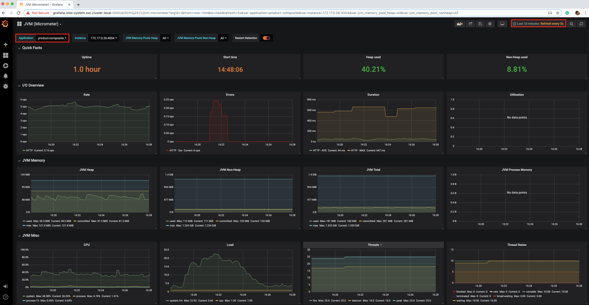

= Monitoring microservices

== add to microservice

Spring Boot 2 supports producing performance metrics in a Prometheus format using the Micrometer library ( https:/​ / ​ micrometer.​ io ).
There's only one change we need to make to the source code: we need to add a dependency to the Micrometer library, micrometer- registry-prometheus , in the Gradle build files, build.gradle , for each microservice.
Here, the following dependency has been added:

[source]
----
implementation("io.micrometer:micrometer-registry-prometheus")
----

To make it easier to identify the source of the metrics once they have been collected by Prometheus, they are tagged with the name of the microservice that produced the metric.
This is achieved by adding the following configuration to the common configuration file, config-repo/application.yml :

[source]
----
management.metrics.tags.application: ${spring.application.name}
----

This will make the microservices produce Prometheus metrics on port 4004 using the "/actuator/prometheus" URI.
To let Prometheus know about these endpoints, each microservice's pod is annotated with the following code:

[source,yml]
----
annotations:
    prometheus.io/scrape: "true"
    prometheus.io/port: "4004"
    prometheus.io/scheme: http
    prometheus.io/path: "/actuator/prometheus"
----

== Monitoring microservices using Grafana dashboards

=== Installing a local mail server for tests

[source]
----
kubectl create deployment mail-server --image djfarrelly/maildev:1.1.0
kubectl expose deployment mail-server --port=80,25 --type=ClusterIP
kubectl wait --timeout=60s --for=condition=ready pod -l app=mail-server

kubectl -n istio-system set env deployment/grafana \
GF_SMTP_ENABLED=true \
GF_SMTP_SKIP_VERIFY=true \
GF_SMTP_HOST=mail-server.hands-on.svc.cluster.local:25 \
GF_SMTP_FROM_ADDRESS=grafana@minikube.me

kubectl -n istio-system wait --timeout=60s --for=condition=ready pod -l app=grafana

----

== Importing existing Grafana dashboards

. Import the dashboard named JVM (Micrometer) by following these steps:
.. On the Grafana web page, click on the + sign in the left-hand side menu and then select Import.
.. On the Import page, paste the dashboard ID 4701 into the Grafana.com Dashboard field and press the Tab key to leave the field.
.. On the Import page that will be displayed, click on the Prometheus drop-down menu and select Prometheus.
.. Now, by clicking on the Import button, the JVM (Micrometer) dashboard will be imported and rendered.
. Inspect the JVM (Micrometer) dashboard by following these steps:
.. To get a good view of the metrics, click on the time picker on the top- right.
This will allow you to select a proper time interval:
... Select Last 5 minutes as the range.
Click on the time picker again and set the refresh rate to 5 seconds.
... Click on the Apply button after specifying the refresh rate.
.. In the Application drop-down menu, which can be found on the top- left of the page, select the product-composite microservice.
. Since we are running a load test using Siege in the background, we will see a lot of metrics.
The following is a sample screenshot:

In this dashboard, we can find all types of Java VM relevant metrics for, among others, CPU, memory, and I/O usage, as well as HTTP-related metrics such as requests/second, average duration, and error rates.
Feel free to explore these metrics on your own!

== Developing your own Grafana dashboards

=== Creating an empty dashboard

. In the Grafana web page, click on the + sign in the left-hand menu and then select dashboard.
. A web page named New dashboard will be displayed:
. Click on the dashboard settings button (it has a gear as its icon), as shown in the preceding screenshot.
Then, follow these steps:
.. Specify the name of the dashboard in the Name field and set the value to Hands-on Dashboard.
.. Click on the Save button.
. Click on the time picker to select the default values for the dashboard, as follows:
.. Select Last 5 minutes as the range.
.. Click on the time picker again and specify 5 seconds as the refresh rate in the Refreshing every field at the bottom of the panel.
.. Click on the Apply button after specifying a refresh rate.
.. Click on the Save button from the menu at the top of the page.
.. Enable Save current time range and click on the Save button in the Save Changes dialog window.

=== Creating a new panel for the circuit breaker metric

. Click on the Add panel button at the top-left of the page (it has an icon of a graph with a + sign next to it).
. Click on the Add Query button.
A page will be displayed where the new panel can be configured.
. In the query field, under the A letter, specify the name of the circuit breaker metric, that is, resilience4j_circuitbreaker_state.
. In the Legend field, specify the format, that is, {{application}}.{{namespace}}.
This will create a legend in the panel where the involved microservices will be labeled with its name and namespace.
. The filled in values should look as follows:
. Click on the third tab, named General, from the left-hand side menu and set the Title field to Circuit Breaker.
. Press the back button on the top-left of the page to get back to the dashboard.

=== Creating a new panel for the retry metric

Here, we will repeat the same procedure that we went through for adding a panel for the preceding circuit breaker metric, but instead, we will specify the values for the retry metrics:

. In the query field, specify rate(resilience4j_retry_calls[30s]) . Since the retry metric is a counter, its value will only go up.
An ever-increasing metric is rather uninteresting to monitor.
The rate function is used to convert the retry metric into a rate per second metric.
The time window specified, that is, 30 s, is used by the rate function to calculate the average values of the rate.
. For the legend, specify {{application}}.{{namespace}} ({{kind}}) . Just like the output for the preceding Prometheus endpoint, we will get four metrics for the retry mechanism.
To separate them in the legend, the kind attribute needs to be added.
. Note that Grafana immediately starts to render a graph in the panel editor based on the specified values.
. Specify Retry as the title.
. Press the back button to get back to the dashboard.

=== Arranging the panels

Perform the following steps to arrange the panels on the dashboard:

. You can resize a panel by dragging its lower right-hand corner to the preferred size.
. You can also move a panel by dragging its header to the desired position.
. The following is an example layout of the two panels:
. Finally, click on the Save button at the top of the page.
A Save Changes dialog will show up; enter an optional description and hit the Save button.

== Setting up alarms in Grafana

=== Setting up a mail-based notification channel

To configure a mail-based notification channel in Grafana, perform the following steps:

. On the Grafana web page, on the menu to the left, click on the Alerting menu choice (with an alarm bell as its icon) and select Notification channels.
. Click on the Add channel button.
. Set the name to mail .
. Select the type to Email .
. Enable Send on all alerts.
. Enable Include image.
. Enter an email address of your choice.
Emails will only be sent to the local test mail server, independent of what email address that's specified.
The configuration of the notification channel should look as follows:

. Click on the Send Test button to send a test mail.
. Click on the Save button.
. Click on the Dashboard button in the left-hand side menu and then on the home button.
. Select Hands-on Dashboard from the list to get back to the dashboard.
. Check the test mail server's web page to ensure that we have received a test email.
You should receive the following output:

=== Setting up an alarm on the circuit breaker

To create an alarm on the circuit breaker, we need to create the alert and then add an alert list to the dashboard, where we can see what alert events have occurred over time.

Perform the following steps to create an alert for the circuit breaker:

. In the Hands-on Dashboard, click on the header of the circuit breaker panel.
A drop-down menu will appear.
. Select the Edit menu option.
. Select the Alert tab in the tab list to the left (shown as an alarm bell icon).
. Click on the Create Alert button.
. In the Evaluate every field, set the value to 10s .
. In the For field, set the value to 0m .
. In the Conditions section, specify the following values:
.. Set the WHEN field to max() .
.. Set the OF field to query(A, 1m, now) .
.. Set the IS ABOVE field to 0.5 .
. Scroll down to confirm that the notification has been sent to the default notification channel, that is, the mail channel we defined previously.
The alarm definition should look as follows:
. Click on the back button (left arrow) to get back to the dashboard.

Then, we need to perform the following steps to create an alarm list:

. Click on the Add panel button at the top of the page.
. Select Choose Visualization in the New Panel page.
. Among the presented visualizations, select Alert List.
Click on it twice to display an Options list.
. Select the Show option called Recent state changes.
. Enable Alerts from this dashboard.
The settings should look as follows:
. Click on the back button to get back to the dashboard.
. Rearrange the panel to suit your needs.
. Save the changes to the dashboard.

